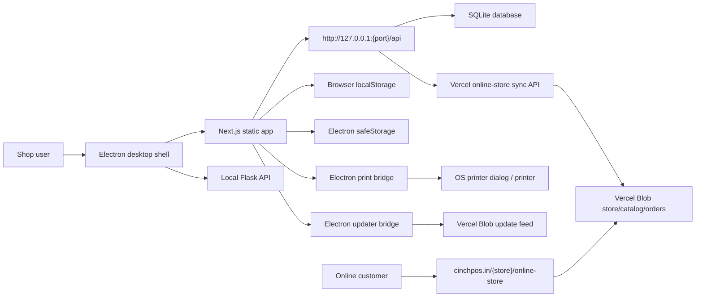
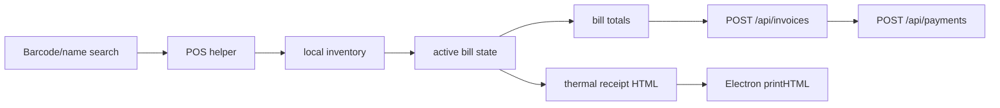
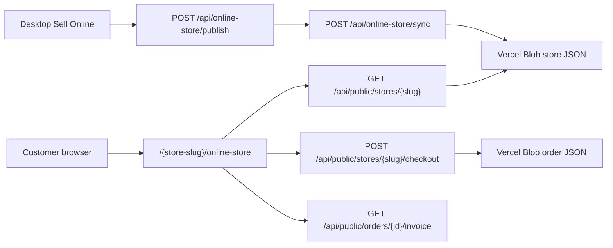
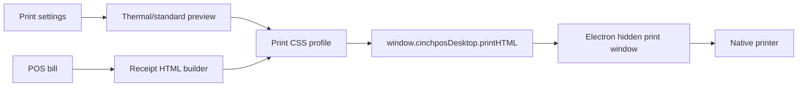

# CinchPOS Detailed Application Architecture

Inspection date: 2026-08-06

This document explains how the current CinchPOS application is arranged, how the desktop app starts, where every major feature lives, how data flows between the frontend, backend, local storage, SQLite, Vercel, and the public online store, and how future features should be developed safely.

## 1. Source Folders

There are two active codebases:

| Area | Path | Purpose |
| --- | --- | --- |
| Desktop application source | `/Users/mahfuz/Desktop/cinchpos/cinchpos desktop` | Main CinchPOS desktop app: Next.js frontend, Flask backend, Electron wrapper, printing, updater, packaging. |
| Public website and update frontend | `/Users/mahfuz/Desktop/cinchpos-vercel-frontend` | Vercel website, download pages, public online store pages, Vercel API routes, release/update metadata. |

The old folder `/Users/mahfuz/Downloads/CinchPOS 5` is not the current source of truth for recent desktop changes.

Generated files and build artifacts should not be treated as source code:

| Generated area | Notes |
| --- | --- |
| `frontend/out` | Static Next.js export served by Electron. Generated by build. |
| `frontend/dist` | Electron installer output. Generated by packaging. |
| `frontend/build` | Desktop icons and packed app assets. Generated/prepared assets. |
| `backend/build`, `backend/dist` | PyInstaller backend output. |
| `backend/runtime/windows-python` | Windows runtime bundle. |
| `backend/database.db` | Local SQLite database. Do not overwrite casually. |

## 2. High-Level Runtime



The desktop app is not a normal browser-only app. Electron launches a local Flask backend, serves the built Next.js frontend, injects runtime configuration, exposes secure storage, handles native printing, and checks for software updates.

## 3. Desktop Boot Lifecycle

The desktop boot is controlled by:

- `frontend/electron/main.cjs`
- `frontend/electron/preload.cjs`
- `frontend/package.json`

Startup flow:

1. Electron starts and acquires a single-instance lock so duplicate main instances do not keep opening.
2. A loading window appears while the runtime is prepared.
3. Electron chooses an available local backend port, usually around `5001`.
4. The frontend is served from the static Next.js export through the custom protocol `cinchpos://app`.
5. Electron starts the Flask backend as a local child process.
6. The backend receives a writable `DATABASE_PATH`, so store data is saved inside the app data location rather than inside the packaged app.
7. Electron exposes runtime config to the frontend through `window.cinchposDesktop.getRuntimeConfig()`.
8. The frontend resolves the actual API base URL dynamically and begins API calls.
9. Electron checks the Vercel update feed and can prompt the user when a new desktop version is available.

Main Electron responsibilities:

| Responsibility | Where |
| --- | --- |
| Create app window and loading window | `frontend/electron/main.cjs` |
| Serve static Next app | `frontend/electron/main.cjs` |
| Start/stop Flask backend process | `frontend/electron/main.cjs` |
| Provide runtime API URL to frontend | `frontend/electron/preload.cjs` |
| Secure local account/session storage | `frontend/electron/preload.cjs` and `frontend/electron/main.cjs` |
| Native print bridge | `frontend/electron/preload.cjs` and `frontend/electron/main.cjs` |
| Auto update checks/download/install | `frontend/electron/main.cjs` |
| App icon and packaging config | `frontend/package.json`, `frontend/build`, `frontend/scripts/prepare-desktop-assets.mjs` |

## 4. Backend Architecture

Backend source:

- `backend/app.py`
- `backend/requirements.txt`
- `backend/tests/test_api.py`

The backend is a Flask API-only service using SQLite. It no longer renders templates for the app UI.

Backend core responsibilities:

| Responsibility | Details |
| --- | --- |
| API-only Flask server | Returns JSON responses for application data. |
| SQLite persistence | Stores customers, invoices, payments, businesses, users, sessions, OTPs, roles, warehouses, online store records, and workspace snapshots. |
| Authentication | Supports local CinchPOS accounts and optional Clerk integration. |
| Password security | Uses PBKDF2 SHA-256 hashing and password policy checks. |
| OTP | Stores hashed OTP codes with expiry and attempt limits. SMTP is configured through environment variables. |
| Role permissions | Permission checks are enforced for protected APIs. |
| Workspace cloud snapshot | Stores frontend module data snapshots per account/business. |
| Online store publishing | Accepts catalog publishing from the desktop app and syncs to public Vercel API when configured. |
| Dashboard API | Aggregates invoice/payment/customer data for dashboard and trend chart. |

Important backend environment variables:

| Variable | Purpose |
| --- | --- |
| `DATABASE_PATH` | Path to SQLite database used by the running app. |
| `CINCHPOS_AUTH_REQUIRED` | Controls whether account login is required. |
| `CINCHPOS_SESSION_SECRET` | Signs/verifies local account sessions. |
| `CINCHPOS_SMTP_HOST` | SMTP server for OTP email. |
| `CINCHPOS_SMTP_PORT` | SMTP port. |
| `CINCHPOS_SMTP_USER` | SMTP username, expected to support `support@cinchpos.in`. |
| `CINCHPOS_SMTP_PASSWORD` | SMTP password/app password. |
| `CINCHPOS_SMTP_FROM_EMAIL` | From email for OTP messages. |
| `CINCHPOS_PUBLIC_STORE_BASE_URL` | Public website base URL for online stores. |
| `CINCHPOS_PUBLIC_STORE_SYNC_URL` | Vercel sync API URL for publishing stores. |
| `CINCHPOS_PUBLIC_STORE_SYNC_TOKEN` | Shared token used to sync catalog data to Vercel. |
| `CLERK_*` | Optional Clerk integration settings. |

## 5. Backend API Groups

| API group | Endpoints | Purpose |
| --- | --- | --- |
| Health | `GET /api/health` | Confirms backend availability. |
| Auth context | `GET /api/auth/context` | Returns account/session/business context. |
| Password rules | `GET /api/auth/password-rules` | Frontend password requirements. |
| Register/login/logout | `POST /api/auth/register`, `POST /api/auth/login`, `POST /api/auth/logout` | Local account lifecycle. |
| OTP | `POST /api/auth/otp/request`, `POST /api/auth/otp/verify` | Email/phone OTP login flow. |
| Businesses | `GET /api/auth/businesses`, `POST /api/auth/businesses` | Multi-business management. |
| Warehouses | `GET /api/auth/warehouses` | Warehouse list and context. |
| Roles | `GET /api/auth/roles`, `POST /api/auth/roles` | Role based access control. |
| Invitations | `GET /api/auth/invitations`, `POST /api/auth/invitations` | Employee invitation/access workflow. |
| Offline session | `POST /api/auth/offline-session` | Offline login/session continuity. |
| Audit | `GET /api/auth/audit` | Account/security audit records. |
| Workspace snapshot | `GET /api/workspace/snapshot`, `PUT /api/workspace/snapshot` | Syncs local module state to account workspace. |
| Recovery | `GET /api/workspace/recover-local-billing`, `POST /api/workspace/recover-local-billing` | Restores local billing after account migration. |
| Dashboard | `GET /api/dashboard`, `GET /api/dashboard/trend` | Revenue, invoice, alert, and trend summaries. |
| Customers | `GET /api/customers`, `POST /api/customers`, `PUT /api/customers/<id>` | Customer records. |
| Invoices | `GET /api/invoices`, `POST /api/invoices`, `DELETE /api/invoices/<id>` | Invoice records and owner-only deletion. |
| Payments | `GET /api/payments`, `POST /api/payments` | Payment records. |
| Online store admin | `GET /api/online-store/profile`, `POST /api/online-store/publish` | Store profile and publishing. |
| Public online store | `GET /api/public/stores/<slug>`, `POST /api/public/stores/<slug>/checkout`, `GET /api/public/orders/<id>/invoice` | Public catalog, checkout, invoice download. |

## 6. Database Architecture

Database:

- `backend/database.db`
- Schema is created/migrated from `backend/app.py`.

Main SQLite tables:

| Table | Purpose |
| --- | --- |
| `customers` | Customer name, phone, email, address, business ownership. |
| `invoices` | Invoice totals, paid/outstanding status, dates, business/warehouse context. |
| `payments` | Payment records connected to invoices and customers. |
| `products` | Legacy product/billing product table. |
| `sales` | Legacy sales table. |
| `purchase_bills` | Legacy purchase bills table. |
| `businesses` | Business account records with generated store/customer identifiers. |
| `warehouses` | Warehouses/branches for business inventory context. |
| `roles` | Role definitions and permissions. |
| `business_memberships` | Users assigned to businesses and roles. |
| `employee_invitations` | Invitations/access setup. |
| `customer_accounts` | CinchPOS account records. |
| `account_sessions` | Active login sessions. |
| `account_otp_codes` | Hashed OTP codes and expiry/attempts. |
| `auth_audit_logs` | Security/auth event logs. |
| `offline_session_grants` | Offline usage permissions. |
| `workspace_snapshots` | Cloud-like snapshot of local frontend module data. |
| `online_stores` | Online store profile and publish status. |
| `online_products` | Products published to online store. |
| `online_orders` | Orders created from public online store checkout. |
| `app_meta` | App metadata and schema bookkeeping. |

Current persistence model is hybrid:

- Core billing records use SQLite APIs.
- Several newer modules are still primarily in frontend localStorage and cloud-synced through `workspace_snapshots`.
- Online store public data is copied to Vercel Blob for public website access.

## 7. Frontend Architecture

Frontend source:

- `frontend/app`
- `frontend/components`
- `frontend/lib`
- `frontend/public`

The frontend uses Next.js App Router, but most application behavior is currently centralized in one large client component:

- `frontend/components/CinchPOSApp.jsx`

The route files in `frontend/app/*/page.js` are thin wrappers. They load the same app shell with a different starting view.

| Route | View |
| --- | --- |
| `/` | Dashboard |
| `/pos` | CinchPOS |
| `/invoices` | Invoices |
| `/customers` | Customer Info |
| `/inventory` | Inventory |
| `/sell-online` | Sell Online |
| `/purchase` | Purchase |
| `/expenses` | Expenses |
| `/sales` | Sales Report |
| `/employee` | Manage Employee |
| `/bank` | Your Bank |
| `/documents` | Store Documents |
| `/transfer` | Retrieve Data |

Frontend helper files:

| File | Purpose |
| --- | --- |
| `frontend/lib/api.js` | Resolves API base URL, attaches auth/business headers, wraps backend fetch calls. |
| `frontend/lib/storage.js` | Safe localStorage read/write and debounced persistence. |
| `frontend/lib/inventory.js` | Inventory normalization, GST breakup, barcode handling, stock calculations. |
| `frontend/lib/format.js` | Money/date formatting helpers. |
| `frontend/lib/cinchpos/constants.js` | App constants, views, storage keys, default settings, transfer config. |
| `frontend/lib/cinchpos/auth.js` | Auth/session helpers, permission matrix, Clerk/local auth glue. |
| `frontend/lib/cinchpos/pos.js` | POS bill state, line creation, barcode matching, summary calculation. |
| `frontend/lib/cinchpos/transfer.js` | CSV/XLSX/JSON/XML import parsing and normalization. |
| `frontend/components/cinchpos/SharedUI.jsx` | Reusable shared UI pieces such as icons, logo/title, modal shell, fields. |
| `frontend/app/globals.css` | Full design system, themes, layout, print preview, thermal receipt CSS. |

## 8. Main App Shell

`CinchPOSApp.jsx` owns the live app shell:

| Area | How it works |
| --- | --- |
| Header | Shows store logo/name, workspace subtitle, and Contact/Support/Help Center links. |
| Right navigation | Uses `appViews` and permission checks to render module navigation. |
| View rendering | Uses `activeView` and a mounted view stack so modules can switch without a page reload. |
| Modal system | Uses `activeModal` and modal-specific state for settings, invoices, support, smart inventory, etc. |
| Local state | Uses many `useState`, `useMemo`, `useEffect`, and helper functions. |
| Local persistence | Uses `storageKeys` and debounced localStorage writes for module data. |
| Cloud snapshot | Authenticated users can save/restore workspace snapshot data. |
| Desktop bridge | Uses `window.cinchposDesktop` for runtime API config, printing, and update checks. |
| Secure storage | Uses `window.cinchposSecureStorage` for login/session data when available. |

The app is feature-rich, but the main architecture risk is that too much logic currently lives inside `CinchPOSApp.jsx`. Future development should gradually extract features into dedicated folders and hooks.

## 9. Data Ownership Map

| Data | Current owner | Persistence | Notes |
| --- | --- | --- | --- |
| Customers | Flask API plus frontend state | SQLite `customers` | Also shown in dashboard/customer table. |
| Invoices | Flask API plus invoice detail cache | SQLite `invoices`, localStorage `cinchPOSInvoiceDetails` | Backend stores totals/status; detailed line items are local snapshot data. |
| Payments | Flask API | SQLite `payments` | Payment status drives reports/dashboard. |
| Inventory | Frontend module | localStorage `cinchPOSInventory`, cloud snapshot | Not yet normalized into backend inventory API. |
| POS open bills | Frontend POS engine | localStorage `cinchPOSReactPOSState`, cloud snapshot | Supports multiple bills and bill deletion. |
| Settings | Frontend settings module | localStorage `cinchPOSSettings`, cloud snapshot | Includes printing, business, theme, support, personalization. |
| Employees | Frontend module | localStorage, cloud snapshot | Role permissions also connect to backend role APIs. |
| Store documents | Frontend module | localStorage, cloud snapshot | File metadata only unless separate file storage is added. |
| Bank data | Frontend module | localStorage, cloud snapshot | UI exists; real banking integrations need formal provider APIs. |
| Purchases/expenses | Frontend module | localStorage, cloud snapshot | Dashboard net balance uses expenses. |
| Account sessions | Backend plus Electron secure storage | SQLite session tables and safeStorage | Logout hides data by clearing session/context. |
| Online store catalog | Backend plus Vercel API | SQLite online tables and Vercel Blob | Public website reads from Vercel Blob. |
| Public online orders | Vercel API | Vercel Blob | Desktop reconciliation is a future hardening area. |

## 10. Feature Modules

### Account And Security

Main files:

- `backend/app.py`
- `frontend/lib/cinchpos/auth.js`
- `frontend/components/CinchPOSApp.jsx`
- `docs/authentication-audit.md`

Capabilities:

- Account creation/login.
- Unique username/email/phone handling in backend account tables.
- Password validation and hashing.
- OTP request/verify APIs.
- Session creation and logout.
- Role-based access control.
- Business and warehouse context.
- Offline session grants.
- Audit logs.
- Secure session persistence through Electron safeStorage.

Development notes:

- Authentication UI lives in `CinchPOSApp.jsx`.
- Permission catalog and default role matrix live in `frontend/lib/cinchpos/auth.js`.
- Backend permission enforcement uses decorators in `backend/app.py`.
- SMTP credentials for `support@cinchpos.in` must be supplied through environment variables, never committed.

### Dashboard And Sales Trend

Main files:

- `frontend/components/CinchPOSApp.jsx`
- `frontend/lib/api.js`
- `backend/app.py`

Capabilities:

- Revenue/current month summary.
- Outstanding payments.
- Total invoice count.
- Net balance.
- Trend chart with daily/weekly/monthly/custom range modes.
- Alerts and notifications from overdue or due-today invoices.
- Quick action buttons.

Data sources:

- `/api/dashboard`
- `/api/dashboard/trend`
- `/api/invoices`
- local expense records for net balance adjustments.

### CinchPOS Billing

Main files:

- `frontend/components/CinchPOSApp.jsx`
- `frontend/lib/cinchpos/pos.js`
- `frontend/lib/inventory.js`
- `frontend/app/globals.css`

Capabilities:

- Multiple live bills.
- Delete unwanted bill tabs.
- Barcode/name search.
- Barcode auto-add.
- Dropdown when multiple products share a barcode.
- Customer can be added before, during, or after billing.
- Walk-in customer fallback when no customer is entered.
- Local cart state.
- Quantity editing.
- Price override button/flow.
- GST/tax calculation.
- Discount calculation.
- Save bill.
- Save and print bill.
- Thermal receipt HTML generation.

Data flow:



### Invoices And Create Standard Invoice

Main files:

- `frontend/components/CinchPOSApp.jsx`
- `frontend/lib/api.js`
- `backend/app.py`

Capabilities:

- Full invoice list.
- Serial number, customer, phone, date, invoice number, amount, paid, outstanding, status.
- View invoice.
- Download invoice.
- Duplicate invoice.
- Delete invoice with owner-only restriction.
- Right-click status menu for paid/unpaid style workflows.
- Create Standard Invoice flow with customer, items, quantities, discounts, taxes, notes, terms, and standard preview/download.

Important limitation:

- The backend invoice table stores invoice totals and status. Detailed line-item invoice content is currently stored in local frontend invoice detail storage and cloud snapshot.

### Customer Info

Main files:

- `frontend/components/CinchPOSApp.jsx`
- `frontend/lib/api.js`
- `backend/app.py`

Capabilities:

- Add customer.
- Update matching customers.
- Phone, name, email, address.
- Optional email/address.
- Customer table with invoice count and outstanding amount.
- Customer details can be connected to billing without clearing the bill.

### Inventory And Smart Inventory

Main files:

- `frontend/components/CinchPOSApp.jsx`
- `frontend/lib/inventory.js`
- `frontend/lib/cinchpos/transfer.js`
- `frontend/app/globals.css`

Capabilities:

- Add/edit inventory items.
- Multiple barcodes per item.
- Manufacturing date.
- Expiry date.
- HSN/SAC.
- Category.
- MRP.
- Selling price.
- Discount percentage.
- GST rate.
- Stock count.
- Stock adjustment add/subtract.
- Reorder level.
- Max stock.
- Warehouse assignment.
- Inventory search.
- Product sorting.
- Load-more virtualized display.
- Click item to open full details in editor.
- Smart Inventory suggestion center.

Smart Inventory suggestions include:

- Low stock alerts.
- Reorder recommendations.
- Overstock alerts.
- Slow-moving inventory.
- Fast-moving inventory insights.
- Duplicate/overlapping product suggestions.
- Cleanup candidates.

Development note:

- Inventory is one of the strongest candidates for backend normalization. Today it is mainly localStorage plus workspace snapshot.

### Retrieve Data

Main files:

- `frontend/components/CinchPOSApp.jsx`
- `frontend/lib/cinchpos/transfer.js`

Capabilities:

- Separate customer, inventory, and invoice import panels.
- Supports CSV, XLSX, JSON, XML.
- Can parse pasted export data.
- Attempts to detect headers intelligently.
- Skips known non-data notes from tools like MyBillBook.
- Validates required fields.
- Updates the correct target module:
  - Customer imports update customers.
  - Inventory imports update inventory.
  - Invoice imports update invoices.

Development note:

- This is a premium-style migration feature and should remain very defensive: do not import unnamed items or items without usable price/stock/barcode/detail data.

### Sell Online

Main files:

- `frontend/components/CinchPOSApp.jsx`
- `backend/app.py`
- `/Users/mahfuz/Desktop/cinchpos-vercel-frontend/src/App.jsx`
- `/Users/mahfuz/Desktop/cinchpos-vercel-frontend/api/_lib/online-store.mjs`
- `/Users/mahfuz/Desktop/cinchpos-vercel-frontend/api/online-store/sync.js`
- `/Users/mahfuz/Desktop/cinchpos-vercel-frontend/api/public/stores/[storeSlug]/index.js`
- `/Users/mahfuz/Desktop/cinchpos-vercel-frontend/api/public/stores/[storeSlug]/checkout.js`
- `/Users/mahfuz/Desktop/cinchpos-vercel-frontend/api/public/orders/[orderId]/invoice.js`

Capabilities:

- Select products to sell online.
- Default online price from offline selling price.
- Override online price.
- Publish online catalog.
- Generate online store URL.
- Public customer can view products.
- Public customer can add to cart.
- Public customer can checkout.
- Public customer can download invoice after checkout.

Online store flow:



### Purchase And Expenses

Main files:

- `frontend/components/CinchPOSApp.jsx`
- `frontend/lib/cinchpos/constants.js`

Capabilities:

- Purchase record entry.
- Supplier, item/material, bill number, date, amount, payment status, notes.
- Expense entry.
- Category, paid to, date, amount, payment mode, notes.
- Local record lists.

### Sales Report

Main files:

- `frontend/components/CinchPOSApp.jsx`
- `frontend/lib/api.js`
- `backend/app.py`

Capabilities:

- Collections summary.
- Outstanding summary.
- Invoice health.
- Paid/pending/overdue counts.
- Download sales report.
- Trend chart is shared conceptually with dashboard trend data.

### Manage Employee

Main files:

- `frontend/components/CinchPOSApp.jsx`
- `frontend/lib/cinchpos/auth.js`

Capabilities:

- Add employee.
- Role/designation.
- Phone.
- Address.
- Aadhar/PAN document metadata upload fields.
- Attendance marking.
- Delete employee.
- Role-based feature access setup.

Development note:

- The UI state exists locally, while permission catalog/role concepts connect to auth helper and backend role APIs. A full production role system should persist employee records and permissions in backend tables.

### Your Bank

Main files:

- `frontend/components/CinchPOSApp.jsx`

Capabilities:

- Bank account workspace area.
- Account/payment information state.

Development note:

- Real banking features must use official bank/payment provider APIs and compliance boundaries. Do not scrape bank portals.

### Store Documents

Main files:

- `frontend/components/CinchPOSApp.jsx`

Capabilities:

- Store document records.
- Document type, title, number, issue date, expiry date, file metadata, notes.
- Saved document list.

### Settings

Main files:

- `frontend/components/CinchPOSApp.jsx`
- `frontend/lib/cinchpos/constants.js`
- `frontend/app/globals.css`

Settings sections:

- Account Info.
- Business Management.
- Personalize.
- Invoicing.
- Printing.
- Data and Safety.
- Support.
- App Info.
- Logout.

Important settings areas:

- Store/business name.
- Store logo.
- Theme.
- Printing paper size/layout/profile.
- Thermal and standard print preview.
- Margin calibration.
- Print footer.
- Logo on thermal bill.
- Business and warehouse management.
- App update check.

### Support And Contact

Main files:

- `frontend/components/CinchPOSApp.jsx`
- `frontend/lib/cinchpos/constants.js`

Capabilities:

- Contact Us.
- Support.
- Help Center.
- Contact phone: `+91 9038956555`.
- Contact email: `cinchlive@gmail.com`.
- Support request forms and local support request tracking.

## 11. Printing Architecture

Printing is split into preview generation and native print execution.

Main files:

- `frontend/components/CinchPOSApp.jsx`
- `frontend/app/globals.css`
- `frontend/electron/main.cjs`
- `frontend/electron/preload.cjs`

Print flow:



Thermal print concepts:

- Paper profiles support common widths such as 58mm, 76mm, and 80mm.
- Receipt content is generated as HTML/CSS, not plain text.
- Electron creates a hidden print window and sends it to the OS print system.
- The print engine attempts to measure continuous receipt height so long bills should not shrink into unreadable output.
- Receipt preview should match actual thermal output as closely as browser/Electron printing allows.

Standard/A4 print concepts:

- Standard invoice preview is separate from thermal receipt preview.
- Standard bill needs customer, business, invoice, item, tax, discount, payment, notes, terms, and total sections.

## 12. Update And Deployment Architecture

Desktop update source:

- `frontend/package.json`
- `frontend/electron/main.cjs`
- `/Users/mahfuz/Desktop/cinchpos-vercel-frontend/public/deployment.json`
- `/Users/mahfuz/Desktop/cinchpos-vercel-frontend/updates/latest.yml`
- `/Users/mahfuz/Desktop/cinchpos-vercel-frontend/updates/latest-mac.yml`
- `/Users/mahfuz/Desktop/cinchpos-vercel-frontend/release.json`
- `/Users/mahfuz/Desktop/cinchpos-vercel-frontend/scripts/upload-cinchpos-release.mjs`

Release flow:

1. Build desktop app.
2. Create macOS and Windows installers.
3. Upload installers and metadata to Vercel Blob.
4. Update Vercel `release.json`, `deployment.json`, and updater feed files.
5. Deploy Vercel frontend.
6. Installed desktop app checks update feed.
7. User sees update prompt.
8. User can accept or skip.
9. Update installs without deleting the writable app data database.

Important rule:

- The app binary should update separately from user data. User data should stay in app userData/SQLite/local workspace storage unless an explicit migration runs.

## 13. Vercel Frontend Architecture

Vercel source:

- `/Users/mahfuz/Desktop/cinchpos-vercel-frontend/src/App.jsx`
- `/Users/mahfuz/Desktop/cinchpos-vercel-frontend/src/main.jsx`
- `/Users/mahfuz/Desktop/cinchpos-vercel-frontend/src/index.css`
- `/Users/mahfuz/Desktop/cinchpos-vercel-frontend/api`

Responsibilities:

| Area | Purpose |
| --- | --- |
| Public website | Product explanation, downloads, pricing/bundles, feature advisor. |
| Download/update hub | Hosts release metadata and installer links. |
| Public online store | Renders `/{store-slug}/online-store`. |
| Public checkout | Creates online order records. |
| Public invoice download | Lets customers download invoice after checkout. |
| Sync API | Accepts catalog publish requests from desktop backend. |

Important Vercel environment variable:

| Variable | Purpose |
| --- | --- |
| `VITE_CINCHPOS_PUBLIC_API_URL` | Base URL used by the website/public store frontend to talk to the live backend API if required. |

## 14. Build, Test, And Run Commands

Desktop frontend/backend:

```bash
cd "/Users/mahfuz/Desktop/cinchpos/cinchpos desktop/frontend"
npm run dev
npm run desktop
npm run desktop:open
npm run test:frontend
npm run test:backend
npm test
```

Desktop packaging:

```bash
cd "/Users/mahfuz/Desktop/cinchpos/cinchpos desktop/frontend"
npm run desktop:dist:mac
npm run desktop:dist:win
```

Vercel frontend:

```bash
cd "/Users/mahfuz/Desktop/cinchpos-vercel-frontend"
npm run dev
npm run build
npm run release:upload -- --version 1.0.x
```

Current verification performed during this architecture pass:

| Command | Result |
| --- | --- |
| `npm run test:frontend` | Passed: 20 frontend tests. |
| `npm run test:backend` | Passed: 10 backend API tests. |

## 15. Recommended Development Pattern For New Features

Before developing any new feature:

1. Decide the owner of the data.
2. Decide where the data is persisted.
3. Add or update backend API if the data must survive login/device changes.
4. Add frontend API wrapper in `frontend/lib/api.js`.
5. Build UI in a feature component or extracted module.
6. Store only temporary UI state in localStorage.
7. Add tests for the pure logic first.
8. Verify desktop and Vercel if the feature affects both.
9. Build installers only after tests pass.

Good data ownership choices:

| Feature type | Recommended storage |
| --- | --- |
| Customer, invoice, payment, account, role, warehouse | Backend SQLite/API first. |
| Temporary open bill/cart state | localStorage plus workspace snapshot. |
| Inventory master data | Backend API eventually; local snapshot only as temporary/offline layer. |
| Public online store catalog | Backend plus Vercel Blob public copy. |
| App settings | localStorage plus cloud snapshot; backend if account-specific multi-device settings are required. |
| Sensitive sessions | Electron safeStorage plus backend session table. |

## 16. Recommended Feature Folder Refactor

The current app works, but `CinchPOSApp.jsx` is too large. To develop every feature individually, gradually split it like this:

```text
frontend/features/
  account/
    AccountGate.jsx
    LoginForm.jsx
    CreateAccountForm.jsx
    permissions.js
  dashboard/
    DashboardView.jsx
    SalesTrend.jsx
    dashboardApi.js
  pos/
    POSView.jsx
    CustomerPanel.jsx
    BillPreview.jsx
    ReceiptPreview.jsx
    usePOSState.js
  invoices/
    InvoiceList.jsx
    InvoiceViewer.jsx
    StandardInvoiceForm.jsx
    invoiceExport.js
  inventory/
    InventoryView.jsx
    InventoryEditor.jsx
    InventoryList.jsx
    SmartInventoryPanel.jsx
    inventoryAnalysis.js
  transfer/
    RetrieveDataView.jsx
    ImportPanel.jsx
    importParsers.js
  settings/
    SettingsModal.jsx
    PrintSettings.jsx
    BusinessSettings.jsx
    AppInfo.jsx
  online-store/
    SellOnlineView.jsx
    onlineStoreApi.js
```

This can be done gradually. Do not move every feature at once unless there is time for full regression testing.

## 17. Current Architecture Risks

| Risk | Why it matters | Recommendation |
| --- | --- | --- |
| `CinchPOSApp.jsx` is very large | Small changes can accidentally affect unrelated modules. | Extract one feature at a time into `frontend/features`. |
| Inventory is mostly localStorage-based | Harder to sync perfectly across devices and accounts. | Add backend inventory tables/API before serious cloud inventory. |
| Invoice line details are local snapshot data | Backend invoices cannot fully reconstruct every printed bill from SQL alone. | Add `invoice_items` table and migrate local invoice details. |
| Online orders live in Vercel Blob | Desktop inventory may not automatically reconcile online sales. | Add order sync/reconciliation into desktop backend. |
| Docs have some stale version references | Can confuse packaging/update work. | Update `DESKTOP_APP.md` after every release workflow change. |
| Generated folders are present in the repo tree | Easy to accidentally commit binaries/runtime/database. | Keep `.gitignore` strict and commit only source/release metadata intentionally. |
| Role permissions are split between frontend helper and backend tables | Risk of UI/backend mismatch. | Treat backend as enforcement source and frontend as display/filter only. |

## 18. Suggested Development Order

For stable long-term development, this order is safest:

1. Account and security hardening.
2. Backend inventory tables/API.
3. Backend invoice item details.
4. POS feature extraction.
5. Print engine isolation and print test fixtures.
6. Online store order reconciliation.
7. Employee permissions fully persisted to backend.
8. Sales reporting from normalized backend tables.
9. Vercel feature bundle advisor integration.
10. Automated installer/release checklist.

This order makes the app more cloud-ready without breaking the shop billing flow.
